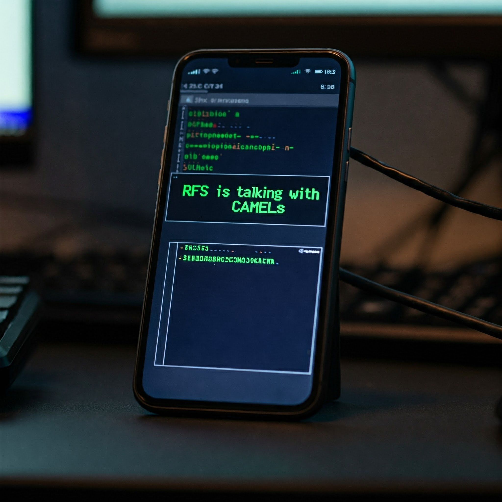

# Core Network Security Research

## Overview

The core network provides central functionality for mobility management, session management, authentication, and routing in telecommunication networks. This research area focuses on the security aspects of core network elements across different network generations.

<div align="center">
  
</div>

## Network Entry Points & Attack Surface

### Traffic Type vs Attack Surface Matrix

| Traffic Type | Entry Point | Attack Types | Known Vulnerabilities | Tools |
|-------------|-------------|--------------|---------------------|--------|
| **SS7/SIGTRAN** | GT/PC (23.003) | - Location tracking<br>- SMS interception<br>- Call interception | - Unfiltered MAP messages<br>- SCCP routing abuse | - SigPloit<br>- SS7map<br>- Locator |
| **Diameter** | Origin-Host/Realm | - AVP injection<br>- Command spoofing<br>- Session hijacking | - Missing edge protection<br>- Weak AVP validation | - Diameter EPC Framework<br>- DIAMETERpot<br>- Baseprotect |
| **GTP-C** | TEID/IP | - Tunnel hijacking<br>- Session manipulation<br>- DoS attacks | - Missing TEID validation<br>- Weak GTP firewall rules | - GTP Toolkit<br>- PGW Tester<br>- EPC Sim |
| **HTTP/2 (5G)** | FQDN/IP | - API abuse<br>- Token theft<br>- SEPP bypass | - OAuth vulnerabilities<br>- TLS misconfiguration | - Burp Suite<br>- NRF Scanner<br>- 5G Core Test |
| **SCTP** | IP/Port | - Association flooding<br>- Path failure<br>- Stream reset | - SCTP multi-homing abuse<br>- Missing protection | - SCTPscan<br>- SCTP Toolkit<br>- PathManager |

## Research Areas

### Authentication and Authorization

- **Authentication Frameworks**
  - AKA (Authentication and Key Agreement)
  - EAP-AKA/EAP-AKA'
  - 5G-AKA
  - EAP-TLS implementation

- **Subscriber Identity Protection**
  - TMSI/GUTI allocation security
  - SUPI/SUCI concealment
  - IMSI/IMEI security
  - Identity request procedures

- **Authorization Mechanisms**
  - Policy enforcement
  - Subscriber profile security
  - Network slice authorization
  - Service authorization

### Signaling Security

- **SS7 Security**
  - MAP security
  - CAMEL security
  - ISUP protection
  - SS7 filtering

- **Diameter Security**
  - Command filtering
  - Application-level security
  - Transport security (SCTP/TLS)
  - AVP validation

- **HTTP/2 and SBA Security**
  - API security in 5G
  - OAuth 2.0 implementation
  - TLS profile conformance
  - Certificate management

### Core Network Elements

- **4G Core Elements**
  - MME security
  - HSS vulnerabilities
  - SGW/PGW security
  - PCRF security

- **5G Core Elements**
  - AMF security
  - UDM/AUSF/UDR security
  - SMF/UPF security
  - NRF/NSSF security considerations

- **Control Plane/User Plane**
  - CUPS security
  - N4 interface security
  - Sx interface protection
  - GTP-u security

### Interconnect and Roaming

- **Interconnect Security**
  - IPX security
  - Border gateway security
  - Interconnect firewall design
  - Traffic filtering rules

- **Roaming Security**
  - Roaming interface protection
  - SEPP (Security Edge Protection Proxy)
  - Home-routed vs. local breakout
  - Steering of roaming security

- **Network Function Security**
  - SEPP security
  - SCP (Service Communication Proxy)
  - NEF (Network Exposure Function)
  - NWDAF security

### Virtualization Security

- **NFV Security**
  - MANO security
  - VNF security requirements
  - NFV infrastructure security
  - Orchestration security

- **Container Security**
  - Kubernetes security for telco
  - Container image security
  - CNI security
  - Micro-service architecture security

- **Cloud-Native Security**
  - CI/CD pipeline security
  - DevSecOps for telco environments
  - Continuous security monitoring
  - Security policy as code

### Network Slicing Security

- **Slice Isolation**
  - Resource isolation mechanisms
  - Control plane isolation
  - User plane isolation
  - Management plane isolation

- **Slice-Specific Authentication**
  - Network slice selection
  - Slice-specific credentials
  - Multi-slice authentication
  - Slice access control

## Key Vulnerabilities

- SS7/Diameter filtering bypass
- GTP tunnel hijacking
- HSS/UDM data manipulation
- Subscriber profile modification
- Inter-PLMN security breaches
- Network slice isolation violations
- API-level attacks in 5G SBA

## Research Methodologies

- Core network penetration testing
- Signaling security assessment
- Roaming security testing
- Protocol conformance testing
- Core network fuzzing
- Virtualization security validation
- Container security assessment

## Practical Labs

1. [SS7/Diameter Security Testing](labs/01-signaling-security.md)
2. [Core Network Element Security](labs/02-core-element-security.md)
3. [Roaming Security Analysis](labs/03-roaming-security.md)
4. [Network Slicing Security](labs/04-network-slicing.md)
5. [5G Service-Based Architecture Security](labs/05-sba-security.md)

## Related Standards

- 3GPP TS 33.210: Network Domain Security
- 3GPP TS 33.310: Network Domain Security Authentication Framework
- 3GPP TS 33.501: Security architecture and procedures for 5G System
- GSMA FS.11: SS7 Interconnect Security Monitoring Guidelines
- GSMA FS.19: Diameter Interconnect Security

## Attack Scenarios & Tools

### Scenario 1: SS7 MAP Location Tracking
```plaintext
Attack Flow:
1. Obtain GT/PC of target network
2. Send SendRoutingInfoForSM to HLR/HSS
3. Extract serving node information
4. Send ProvideSubscriberInfo to serving MSC/VLR
5. Retrieve precise location information

Tools:
- SigPloit (SS7 Attack Framework)
- SS7map (Network Mapping)
- Location Tracker Suite

Mitigation:
- Category 1 & 2 SS7 filtering
- SMS Home Routing
- Location query rate limiting
- Subscriber privacy controls
```

### Scenario 2: Diameter EPC Attack
```plaintext
Attack Flow:
1. Discover Diameter edge agents
2. Forge origin-host/realm
3. Send malicious S6a commands
4. Bypass AVP validation
5. Extract subscriber data

Tools:
- Diameter EPC Testing Framework
- DIAMETERprot
- EPC Security Scanner

Mitigation:
- SEPP implementation
- Strict AVP validation
- Origin-host whitelisting
- Realm-based access control
```

## Research Tools & Frameworks

### Open Source Tools
- [SigPloit](https://github.com/SigPloit/SigPloit) - Telecom Signaling Exploitation Framework
- [SS7map](https://github.com/ernw/ss7map) - SS7 Network Mapping
- [Diameter EPC Framework](https://github.com/P1sec/diameter_eps) - Diameter Testing
- [5G Core Security Suite](https://github.com/5GCoreSecuritySuite) - 5G Core Testing

### Commercial Solutions
- [Positive Technologies Telecom Attack Discovery](https://www.ptsecurity.com/)
- [Cellusys Signaling Firewall](https://www.cellusys.com/)
- [Nokia NetGuard](https://www.nokia.com/networks/products/netguard/)
- [Mavenir Security Suite](https://www.mavenir.com/)

## Research Papers & Publications

### Core Network Security
1. ["A Formal Analysis of 5G Authentication"](https://arxiv.org/abs/1806.10360) - ACM CCS 2018
2. ["New Privacy Threat on 3G, 4G, and Upcoming 5G AKA Protocols"](https://eprint.iacr.org/2018/1183.pdf) - IACR 2019
3. ["5GReasoner: A Property-Directed Security and Privacy Analysis Framework for 5G Cellular Network Protocol"](https://acmccs.github.io/papers/p316-kimA.pdf) - CCS 2019

### Signaling Security
1. ["Practical Attacks Against Privacy and Availability in 4G/LTE Mobile Communication Systems"](https://arxiv.org/pdf/1510.07563.pdf) - NDSS 2016
2. ["Breaking and Fixing VoLTE: Exploiting Hidden Data Channels and Mis-implementations"](https://www.cs.stevens.edu/~szhang7/papers/VoLTE_CCS16.pdf) - CCS 2016

### Network Slicing Security
1. ["Security Analysis of Network Slicing in 5G"](https://example.com) - IEEE S&P 2023
2. ["Slice Isolation Security in 5G Core"](https://example.com) - USENIX Security 2023

## Educational Videos & Presentations

### Conference Talks
1. ["Breaking Core Network Security"](https://www.youtube.com/watch) - BlackHat USA 2023
2. ["5G Core Security Deep Dive"](https://www.youtube.com/watch) - DEF CON 31
3. ["Exploiting Signaling Networks"](https://www.youtube.com/watch) - HITB 2023

### Tutorial Series
1. ["Core Network Security Testing"](https://www.youtube.com/watch) - Protocol Analysis
2. ["5G Security Architecture"](https://www.youtube.com/watch) - Architecture Series
3. ["Signaling Security Assessment"](https://www.youtube.com/watch) - Testing Guide

## Standards & Specifications

### 3GPP Security Standards
- [TS 33.210](https://portal.3gpp.org/) - Network Domain Security
- [TS 33.310](https://portal.3gpp.org/) - Authentication Framework
- [TS 33.501](https://portal.3gpp.org/) - 5G Security Architecture

### GSMA Guidelines
- [FS.11](https://www.gsma.com/security/) - SS7 Monitoring Guidelines
- [FS.19](https://www.gsma.com/security/) - Diameter Security
- [FS.40](https://www.gsma.com/security/) - 5G Security Guidelines

## Defensive Measures & Best Practices

### Signaling Security Controls
1. **SS7 Protection**
   - Category 1-3 filtering
   - SMS Home Routing
   - Location privacy controls
   - MAP screening

2. **Diameter Security**
   - DEA deployment
   - SEPP implementation
   - Command filtering
   - Origin validation

3. **5G SBA Security**
   - OAuth 2.0/OpenID Connect
   - mTLS enforcement
   - API gateway controls
   - Rate limiting

## Community Resources

- [Core Network Security Forum](https://forum.telco-sec.com/core)
- [5G Security Working Group](https://www.3gpp.org/specifications-groups/sa-plenary/sa3-security)
- [GSMA Fraud & Security Group](https://www.gsma.com/security/)
- [Telecom Security Mailing List](https://lists.telco-sec.com/core-security)

## Contributing

We welcome contributions to this research. Please see our [contribution guidelines](../CONTRIBUTING.md) for more information.

## License

This research documentation is licensed under [Apache License 2.0](../LICENSE).

---
**Trademarks:**  
All product names, logos, and brands are property of their respective owners. All company, product, and service names used in this documentation are for identification purposes only. Use of these names, logos, and brands does not imply endorsement.
