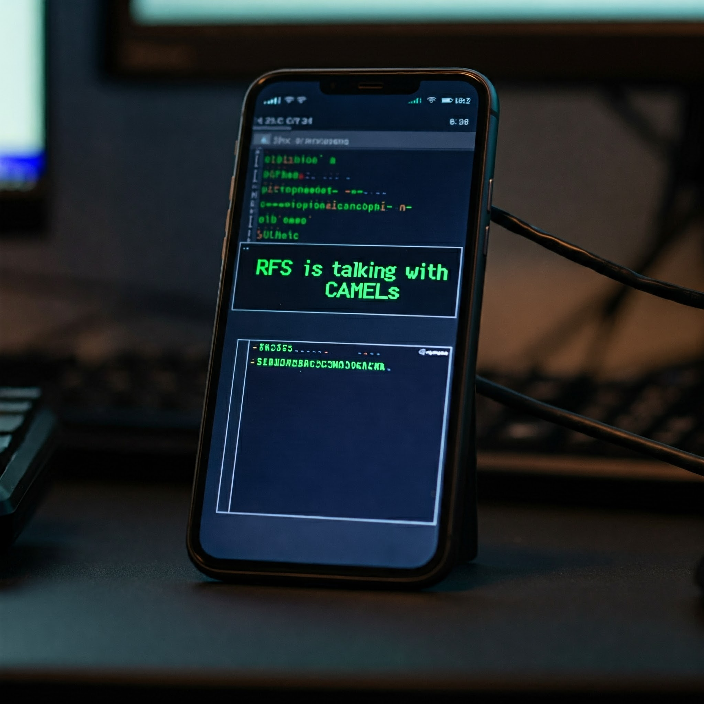

  

> **TelcoSec: Advancing Global Telecommunications Security Together**
>
> 🚀 Join our open research community and help secure the future of telecom!

> **Project Maintainer:**
> This project is currently maintained by **RFS**. We welcome passionate contributors—join us and become part of the TelcoSec team!

# 🔐 TelcoSec - Telecommunications Security Research Initiative

  
  
  ### **Advancing Telecommunications Security Research Since 2020**
  
  
  
  
  

## 📋 Overview

TelcoSec is a pioneering open research community dedicated to advancing telecommunications security knowledge and practices. Founded in 2020, our initiative brings together industry professionals, researchers, and security experts to address critical challenges in telecom security.

  

## 🎯 Mission & Vision

Our mission is to enhance the security landscape of telecommunications through:

- Advanced research and development in telecom security
- Knowledge sharing and community collaboration
- Development of open-source security testing tools
- Practical insights from industry experience
- Standardization of security testing methodologies

  

## 🔬 Research Areas

### Core Focus
- **Network Security**: Comprehensive analysis of 2G-5G architectures
- **Protocol Security**: SS7, Diameter, and SIP signaling
- **Infrastructure**: Core network and RAN security
- **Identity & Authentication**: SIM/eSIM security mechanisms
- **Emerging Technologies**: 5G security architecture and beyond

  

### Current Research Initiatives

<table>
  <tr>
    <td></td>
    <td></td>
    <td></td>
  </tr>
  <tr>
    <td></td>
    <td></td>
    <td></td>
  </tr>
</table>

## 🚀 Projects

TelcoSec leads and documents a range of research and development projects in telecommunications security. Explore some of our featured projects below, or see the full list in the [projects directory](projects/README.md):

- **[5G Security Architecture Analysis](projects/5g-security-architecture-analysis.md)**  
  In-depth analysis of 5G core and RAN security features, vulnerabilities, and mitigations.  
  _Status: Ongoing_

- **[Signaling Cross-Protocol Attacks](projects/signaling-cross-protocol-attacks.md)**  
  Research on cross-protocol attacks involving SS7, Diameter, and SIP signaling.  
  _Status: Ongoing_

- **[Legacy 2G Persistence Risks](projects/legacy-2g-persistence-risks.md)**  
  Assessment of security risks in legacy 2G networks and their impact on modern telecom environments.  
  _Status: Published_

- **[IoT Telecom Protocol Misuse](projects/iot-telecom-protocol-misuse.md)**  
  Investigation of IoT device vulnerabilities and protocol misuse in telecom networks.  
  _Status: In Progress_

- **[Private Radio Interface Security](projects/private-radio-interface-security.md)**  
  Security research on private LTE/5G and radio interface deployments.  
  _Status: Planned_

- **[SIM/eSIM Security Research](projects/sim-esim-security-research.md)**  
  Technical research on SIM and eSIM vulnerabilities, provisioning, and authentication.  
  _Status: Published_

For more projects and details, visit the [projects directory](projects/README.md).

## 📚 Documentation & Resources

  

### Official Platforms
- [TelcoSec Knowledge Center](https://www.telco-sec.com/) - Comprehensive telecommunications security resources and learning paths
- [3GPP Explainer](https://3gpp.telco-sec.com/) - Detailed guide to 3GPP standards and mobile network technologies
- [SIM/eSIM Guide](https://sim-cards.telco-sec.com/) - Technical details of SIM cards, eSIMs, and mobile connectivity
- [Security Documentation](https://docs.telco-sec.com/) - Comprehensive security guidelines and best practices
- [TelcoSec Chat](https://chat.telco-sec.com/) - Interactive assistance for telecom security queries

### Research Documentation
- [SIM/eSIM Security Research](docs/sim-esim-research.md)
- [Baseband Security Research](docs/baseband-research.md)
- [Mobile Internals Research](docs/mobile-internals-research.md)
- [RAN Security Research](docs/ran-research.md)
- [Core Network Security Research](docs/core-network-research.md)
- [Technology-Specific Research](docs/tech-specific-research.md)
- [PLMN Integration Research](docs/plmn-integration-research.md)

  

### Community Resources
- [Contributing Guidelines](docs/contributing.md)
- [Security Policy](https://github.com/TelcoSec/security-policy/blob/main/SECURITY.md)
- [Issue Tracker](https://github.com/TelcoSec/research/issues)

## 🤝 Community Engagement

### How to Contribute
We welcome contributions from the security and telecommunications community. Please review our [contribution guidelines](docs/contributing.md) before submitting pull requests.

### Security Disclosure
For responsible disclosure of telecom system vulnerabilities, please follow our [security policy](https://github.com/TelcoSec/security-policy/blob/main/SECURITY.md).

  

## 📬 Connect With Us

  <table>
    <tr>
      <td align="center">
        <strong>General Contact</strong>
         
        <a href="https://telco-sec.com">Website</a>
         
        <a href="mailto:contact@telco-sec.com">contact@telco-sec.com</a>
      </td>
      <td align="center">
        <strong>Research Inquiries</strong>
         
        <a href="mailto:research@telco-sec.com">research@telco-sec.com</a>
      </td>
      <td align="center">
        <strong>Security Reports</strong>
         
        <a href="mailto:security@telco-sec.com">security@telco-sec.com</a>
      </td>
    </tr>
  </table>

### Social Media & Community

  
  
  
  
  

## 📢 Share This Project

> **Suggested LinkedIn Post:**  
> 🚀 Excited to support open telecom security research with @TelcoSec! Explore 5G, SS7, SIM/eSIM, RAN, and more. Join the community: https://github.com/TelcoSec

<!-- Open Graph image for social media sharing -->
<!-- LinkedIn and other platforms will use this image for link previews -->
<!-- <meta property="og:image" content="https://raw.githubusercontent.com/TelcoSec/repo/main/profile/images/og-image.jpg" /> -->

## 📜 License

This project is licensed under the [Apache License 2.0](LICENSE) unless otherwise specified.

---

  
  

## Contact

- Website: [telco-sec.com](https://telco-sec.com)
- Email: [contact@telco-sec.com](mailto:contact@telco-sec.com)

## 📡 GSM Security & Pentesting Labs

Explore hands-on GSM security research, pentesting labs, and device hacking guides at [TelcoSec GSM Hacking](https://gsm-hacking.telco-sec.com/).

Key topics:
- GSM attack types and real-world scenarios
- Step-by-step GSM pentest lab setup
- SIM card security and AT commands
- Passive sniffing, IMSI catching, SMS/voice interception
- Security of GSM-based IoT and consumer devices

> **Note:** This resource is for educational purposes only. Always follow legal and ethical guidelines.

Join the [TelcoSec Ops Discord](https://discord.gg/jkUKw2cBxX) for community support and updates.

Source: [TelcoSec GSM Hacking](https://gsm-hacking.telco-sec.com/)

## 🔄 Diameter Protocol Training & Resources

Dive into comprehensive Diameter protocol training and resources at [Learn Diameter](https://diameter.learn-telecom.com/).

Key topics:
- Diameter protocol fundamentals and RFCs
- Diameter applications and AVPs (Attribute-Value Pairs)
- Node types, transport, and peer relationships
- Routing, forwarding, and interfaces (IMS, EPC, PCC, 3GPP)
- Security considerations and proprietary AVP testing

> This resource is highly recommended for telecommunications engineers and anyone seeking to master Diameter in 3GPP networks.

Source: [Learn Diameter](https://diameter.learn-telecom.com/)

## 💳 SIM Card Technology & Security

Explore in-depth SIM card technology, internals, and security at [Learn SIM Cards](https://sim-cards.learn-telecom.com/).

Key topics:
- SIM card technology and architecture
- SIM card internals and types
- Algorithms and authentication keys (Ki, PIN2, PUK2)
- GSM identifiers (ICCID, IMSI, etc.)
- SIM card security and attack techniques
- SIM card software and tools

> This resource is ideal for anyone interested in the technical and security aspects of SIM cards in mobile networks.

Source: [Learn SIM Cards](https://sim-cards.learn-telecom.com/)

## 📝 TelcoSec Blog & Tutorials

Stay up to date with the latest telecom security insights, tutorials, and news at the [TelcoSec Blog](https://blog.telco-sec.com/).

Featured topics:
- How to Install Kamailio and Open5GS
- GSM Hacking Fundamentals
- Demystifying Diameter Interfaces
- How to Configure and Install OsmoBTS
- GSM Security Standards

> The TelcoSec Blog is your go-to resource for practical guides, security standards, and expert commentary on telecom infrastructure and protocols.

Source: [TelcoSec Blog](https://blog.telco-sec.com/)
